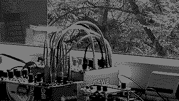

# shinythings

Accumulate shiny things! Dual integrator for crow

## Documentation

    → 1 signal 1
    → 2 signal 2
      1 signal 1 integral  →
      2 signal 1 derivate  →
      3 signal 2 integral  →
      4 signal 2 derivate  →

Accumulate all the shiny things! A pair of integrators, meaning two accumulators are collecting from inputs 1 and 2, capped by hardware limits at -5 an 10 volts.

Non-linear response is hopefully useful/interesting at slow rates near 0 as well as higher voltages. There are exponential `i_bend` and linear `d_div` factors you can tune to change mapping voltage. They are crow public variables, change them via druid, bowering or livecoding from maiden. Low integral bend values make more room around 0V, high values overrespond towards squares for higher rates. Lower derivate divisor values yield mellower values.

No shortage of glitchy aliasing effect etc.

caw!
